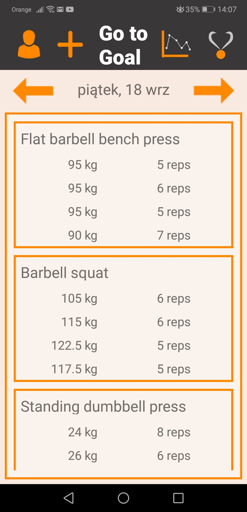
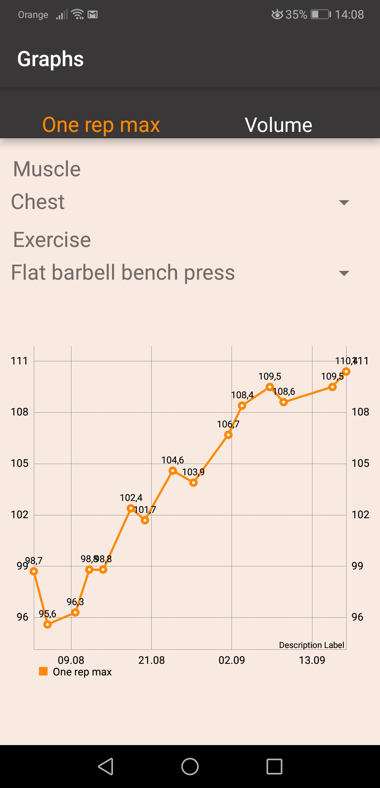
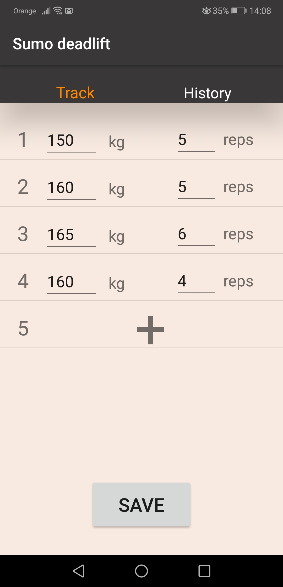
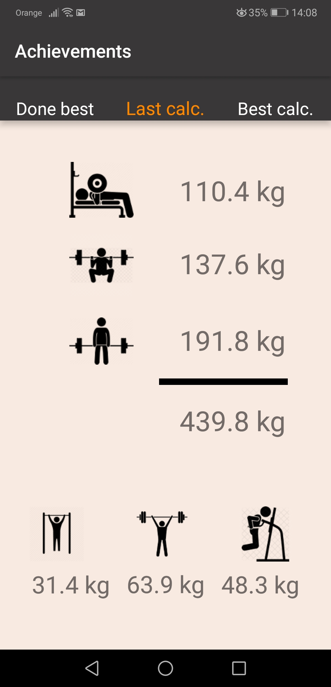

# Go to Goal
Go to Goal is an app, which lets us save our gym workouts and track them owing to graphs or other functionalities. It has SQL database in which all data is written.
 
 
 

  
  &nbsp;&nbsp;&nbsp;&nbsp;&nbsp;&nbsp;&nbsp;&nbsp;&nbsp;&nbsp;
  

 

  
  &nbsp;&nbsp;&nbsp;&nbsp;&nbsp;&nbsp;&nbsp;&nbsp;&nbsp;&nbsp;
  

